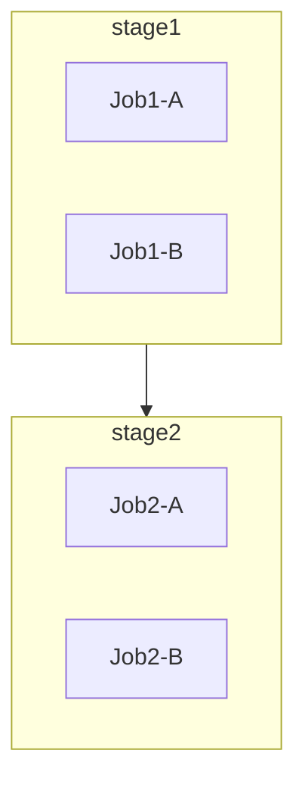
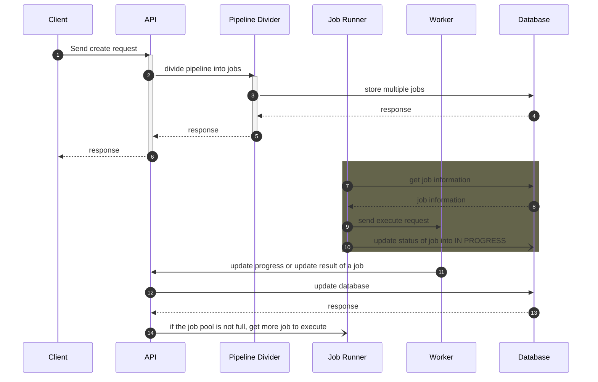
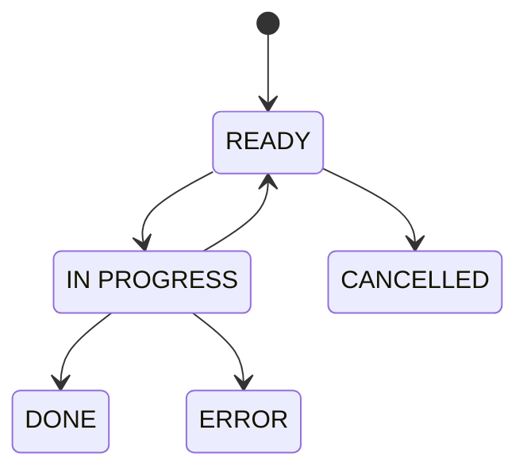

# Task Pipeline

Status of this repository: currently, this repository just contains this `README.md` file for design concept.

## Purpose

This service is used for queueing, scheduling and distributing tasks.


## Definitions

- **Pipeline**: a pipeline is a whole process to execute a task.
- **Stage**: in a pipeline, there are one or more stages exist. **Jobs** in **stages** are run sequentially, **jobs** in the same **stage** are run parallel if the queue or **runner** are available.
- **Job**: a job is the smallest unit in whole process. A job is a step to be executed, it may be a shell command, a request to Kubernetes API to deploy a service, etc.
  - **Kind**: each job has a required attribute name **kind** to determine which kind of this job to execute in the right way. For example: `Shell`, `K8S/Deployment`, `K8S/Job`, etc. The **Task Pipeline** SHOULD implement logic for each kind.
  - Each job and each kind of job have their own parameters. For example, an `K8S/Deployment` needs `container name`, `image name` but `Shell` MAY NOT need.
- **Runner** or **Worker**: is a service, a client to whom **Task Pipeline** sends request. For example: a server, an API of Kubernetes, etc.
- **Client**: a client is the task sender to Pipeline. A client has its `clientId` and `clientSecret` to authenticate and to authorize with **Task Pipeline**. A client SHOULD has its own configuration, for example max job to run.

## Configurations

- `QUEUE_SIZE`: the size of jobs queue, max jobs can be enqueued.
- Queue size for a specific **client**: a soft configuration can be set in database.

## Priority

Priority to run job is follow this sequence:

1. High priority **client** runs first.
2. High priority **task** runs first.
3. High priority **stage** runs first.
4. High priority **job** runs first.

## Pipeline detail



List of required elements:

- `stages`: list of stages, ordered by priority, first to last.
- `jobs`: list of jobs
  - `name`: string, name of job
  - `stage`: string, stage name to which stage this job belongs.
  - `kind`: string, kind of job.
  - `version`: string, semantic version, version of schema of this `kind`.
  - `priority`: integer, order to run in the same stage, the smaller value the higher priority. Not required, default `10`.
  - `params`: object parameter
  - `retry_attempt`: integer, number of time of retry if the job is failed or timed-out. Not required, default `0`, means no retrying.
  - `allow_failure`: boolean, `true` means failure of this job will not stop the pipeline. Not required, default `false`.
  - `timeout`: integer, seconds to run, if exceed then consider this job is timeout. Not required.

A YAML example:

```yaml
stages:
- test
- build

jobs:
    - name: test-something
      stage: test
      ...
    - name: build-project
      stage: build
      ...
```

```json
{
    "stages": ["test", "build"],
    "jobs": [
        {
            "name": "test-something",
            "stage": "test"
            ...
        },
        {
            "name": "build-project",
            "stage": "build"
            ...
        },
    ]
}
```

## Components

There are 3 components in this service:
- API: RESTFul API for CRUD pipelines, jobs
- Pipeline Divider: divide pipeline into stages, divide stage into jobs.
- Job Runner: collect jobs in database and run.

### General Flow



## Job states

